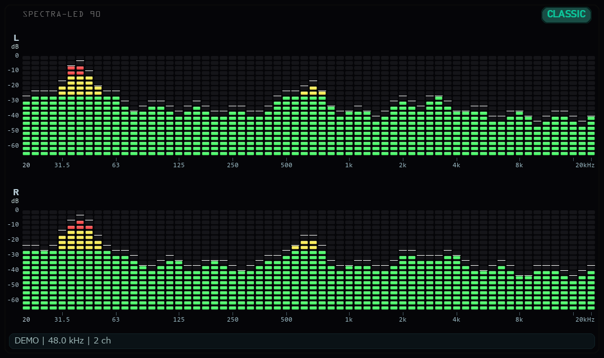

# Wune

80～90年代のミニコンポをイメージした、Windows用のLEDスペクトラムアナライザーです。
いつものスピーカーやヘッドホンで音楽を聴きながら、左右の音の動きを楽しめます。
配色、LEDの形、配置、ビートへの反応を設定画面から調整できます。

現行の描画処理による表示例です（デモデータ使用。音声機器の測定結果ではありません）。

## ダウンロード

**[GitHub Releases](https://github.com/yshdsnd/wune/releases)** からWindows用ZIPをダウンロードします。
ファイル名は **Wune-vX.Y.Z-win64.zip** です。X.Y.Zはバージョン番号です。
GitHubが自動で表示する「Source code」は通常利用向けの配布物ではありません。

**現在はv1.0の公開準備中です。** 公開版ZIPがReleasesにない場合は、公開後にこの手順で入手できます。

## はじめる

1. ZIPを右クリックし、「すべて展開」で好きなフォルダーへ展開します。
2. 展開先の **Wune** フォルダーを開きます。
3. 普段の音楽アプリなどで、スピーカー／ヘッドホンから音を再生します。
4. **Wune.exe** をダブルクリックします。

**Python、VB-CABLE、通常利用時の管理者権限は不要です。**
ZIPの中から直接起動せず、フォルダー全体を展開してください。
Wune.exeの隣にある **_internal** フォルダーも必要です。EXEだけを別の場所へ移動しないでください。
デスクトップから使う場合は、Wune.exeへのショートカットを作成できます。

起動時のWindowsの既定の出力先を読み取ります。Wune自身は音を再生したり、出力先を変更したりしません。
情報欄で取得中のデバイス名・サンプルレート・チャンネル数を確認できます。
出力先やWindows側のサンプルレートを変えた後は、Wuneを再起動してください。

### 更新・アンインストール

更新時はWuneを終了し、新しいZIPを別のフォルダーへ展開して起動します。
設定はユーザー別フォルダーにあるため、アプリのフォルダーを替えても引き継ぎます。
正常動作を確認したら古いアプリのフォルダーを削除し、ショートカットの参照先も更新してください。

アンインストールはWuneを終了して、展開したフォルダーとショートカットを削除します。
設定・ログも削除したい場合は、下記の保存先フォルダーを削除してください。

## 基本操作

メイン画面をクリックしてからキーを押してください。

| 操作 | 機能 |
| --- | --- |
| F2 | 設定画面を開く |
| F11 | 全画面／通常ウィンドウの切り替え |
| Space | 表示の一時停止／再開。音楽の再生は止まりません |
| T、または右上のテーマ名を左クリック | 次の配色テーマへ切り替え |
| I | 出力デバイスなどの情報欄を表示／非表示 |
| Esc、Q、または閉じるボタン | 終了 |
| ウィンドウの端をドラッグ | 表示を拡大／縮小 |

LEDの形や間隔を保つため、ウィンドウサイズには最小値と縦横比の補正があります。
幅と高さを完全に独立して変更することはできません。
F2を全画面で押すと通常ウィンドウへ戻ります。
設定画面の編集中は、T・I・テーマ名クリックによる変更を停止します。
設定画面側のEsc／閉じるボタンは、アプリ終了ではなく設定のキャンセルです。

## 設定とカスタマイズ

**F2**で設定画面を開きます。音楽を再生したまま、メイン画面で変更をプレビューできます。

| タブ | 主な設定 |
| --- | --- |
| 配置・LED | 表示言語、周波数／レベルの向き、L/Rの上下・左右配置、LEDの表現・形・縦横比、情報欄、表示上限を20 kHzに制限 |
| テーマ・配色 | 配色の選択、新規作成・複製・名前変更・削除、各部の色を編集 |
| 動作 | 立ち上がり時間、下降時間、ピーク保持時間、ピーク落下速度 |

「LEDの幅／高さ」は形の比率です。数値を増やすと横長になります。全体の大きさはウィンドウのリサイズで調整します。
テーマは配色だけを保存し、LEDの形・配置・動作は独立した設定です。
組み込みテーマを編集するとユーザー用コピーを作成するため、元の配色は残ります。

| ボタン | 動作 |
| --- | --- |
| 保存 | 現在の変更を直ちにファイルへ保存して、設定画面を閉じる |
| 適用 | 変更を確定し、設定画面を開いたままにする。ファイルへの保存は正常終了時 |
| キャンセル／閉じる／Esc | 最後に適用した状態へ戻る。未適用なら設定画面を開く前へ戻る |
| 表示を既定に戻す | 表示設定と配色を既定へ戻してプレビュー。表示言語・動作設定・ユーザーテーマ一覧は保持 |
| 動きだけ既定に戻す | 動作タブの4項目だけを既定へ戻してプレビュー |

アプリを終了すると、ウィンドウのサイズ・位置、確定した表示設定・テーマ・動作設定を保存し、次回起動時に復元します。
設定画面を開いたまま終了した場合、未適用のプレビューは保存しません。

### 日本語／英語の切り替え

F2 → **配置・LED**（Layout and LEDs）→ **表示言語**（Language）で、
自動（システム）／English／日本語を選べます。自動で未対応の言語を検出した場合は英語になります。
メイン画面にはすぐ反映されます。設定画面は「保存」で閉じるか、「適用」して閉じてから、F2で開き直すと切り替わります。
Windows標準のカラーピッカーはWindows側の表示言語に従います。

## 設定の保存先と初期化

エクスプローラーのアドレス欄に、次を貼り付けて開きます。

~~~text
%LOCALAPPDATA%\Wune
~~~

| ファイル | 内容 |
| --- | --- |
| settings.json | 表示設定・ユーザーテーマ・通常ウィンドウの位置とサイズ |
| Wune.log | 配布EXEの起動・実行ログ。起動ごとに上書き |

設定画面の下部にも保存先を表示します。設定をバックアップするときはWuneを終了し、settings.jsonをコピーしてください。

すべて初期化するには、Wuneを終了し、**settings.jsonを別の場所へ移動**してから起動します。
ユーザーテーマやウィンドウ位置も既定に戻ります。戻したい場合は終了後にバックアップを置き戻します。
壊れた設定や未対応の保存形式は上書きせずに既定値で起動するため、設定が保存されない場合もこの方法を試せます。

コマンドで初期化する場合は、Wune.exeのあるフォルダーでPowerShellを開きます。
この操作は既存の設定ファイルを削除するため、必要なら先にバックアップしてください。

~~~powershell
.\Wune.exe --reset-settings
~~~

## 動作環境と制限

- **動作確認済み：Windows 11（64ビット）、x64版パッケージ。**
- ステレオ音声を再生できる出力デバイスが必要です。
- Windows 10・Windows on ARMは未検証です。32ビット版、macOS、Linux、FreeBSD向けの配布物はありません。
- 音声はWindowsの既定の出力先からWASAPIループバックで取得します。マイク入力・音声ファイルの直接読み込みには対応していません。
- 起動中の出力デバイス切り替えやサンプルレート変更には自動追従しません。
- 取得対象はチャンネル0/1です。サラウンド全体のダウンミックスやモノラル専用デバイスには対応していません。
- 音声デバイス・バンド数の変更は設定画面にはありません。
- 高いサンプルレートでは表示上限が最大40 kHzになります。「表示上限を20 kHzに制限」で可聴帯域に絞れます。
- 狭い表示では目盛りの一部を省略します。レベル表示は帯域ごとの目安で、音圧・トゥルーピークの測定器ではありません。
- 実行中のDPI変更・ディスプレイ構成変更は未検証です。

## 困ったとき

| 症状 | 確認すること |
| --- | --- |
| 起動しない、すぐ閉じる | ZIP全体を展開したか、_internalがEXEと同じフォルダーにあるかを確認。表示されたエラーとWune.logを確認 |
| スペクトラムが動かない | Spaceで一時停止を解除し、音が再生されているか、情報欄の出力先が再生アプリの出力先と同じかを確認 |
| ヘッドホンなどに替えると動かない | Windowsの出力先を確認し、Wuneを再起動 |
| F2などのキーが効かない | メイン画面をクリックしてから操作。設定画面が背後に開いていないかも確認 |
| 設定が戻る／保存されない | 「保存」または「適用」後に正常終了したかを確認。保存先とログを確認し、必要ならバックアップ後に初期化 |
| 設定画面だけ言語が変わらない | 言語を保存・適用してから設定画面を開き直す |

解決しない場合や機能の提案は **[GitHub Issues](https://github.com/yshdsnd/wune/issues)** へお願いします。
不具合の報告には、次の情報を添えると調査しやすくなります。

- Wuneのバージョン（ZIP名または同梱のbuild-info.json）、Windowsのバージョン
- 音声出力デバイス名、情報欄のサンプルレート、再現手順
- 期待した動作と実際の動作、必要に応じて画面画像
- エラー表示と、問題が起きた直後のWune.log

ログや画面に含まれるユーザー名など、公開したくない情報は取り除いてください。

## 開発・ソースからの実行

通常利用は上記のZIPをご利用ください。Python環境の準備、ソースからの起動、開発用設定、テストについては
**[開発者向けガイド](docs/development.md)** にまとめています。
配布ZIPの作成と公開前の確認は **[パッケージ作成ガイド](docs/packaging.md)** を参照してください。

## クレジット・ライセンス

WuneはNumPy、pygame／SDL、SoundCard／CFFI、Python／Tcl・Tkを利用し、配布にはPyInstallerを使用しています。
配布ZIPのlicensesフォルダーに依存ソフトウェアのライセンス・通知を同梱します。
独自アイコンの出典と制作記録は[アイコンの説明](https://github.com/yshdsnd/wune/blob/main/wune/assets/README.md)にあります。

Wune本体のライセンスは現在未設定です。公開前に利用・再配布条件を確定する予定です。
