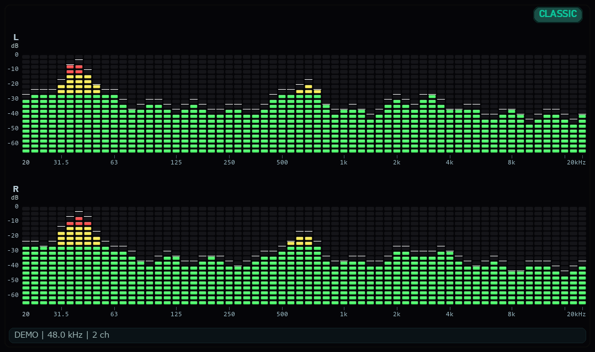

# Wune

**日本語** / [English](README.en.md)

80～90年代のミニコンポをイメージした、WindowsおよびmacOS用のLEDスペクトラムアナライザーです。
いつものスピーカーやヘッドホンで音楽を聴きながら、左右の音の動きを楽しめます。
配色、LEDの形、配置、ビートへの反応を設定画面から調整できます。

現行の描画処理による表示例です（デモデータ使用。音声機器の測定結果ではありません）。

## ダウンロードと導入

各プラットフォーム向けのパッケージを **[GitHub Releases](https://github.com/yshdsnd/wune/releases)** からダウンロードできます。
GitHubが自動で表示する「Source code」ではなく、ビルド済みのZIPパッケージをご利用ください。

- **Windows用**: `Wune-vX.Y.Z-win64.zip`（Windows 11 x64対応）
  - インストールと起動手順は **[Windows向け導入ガイド (INSTALL_WINDOWS.md)](INSTALL_WINDOWS.md)** をご覧ください。
- **macOS用**: `Wune-vX.Y.Z-macos-arm64.zip`（Apple Silicon対応）
  - インストール、セキュリティ許可、起動手順は **[macOS向け導入ガイド (INSTALL_MACOS.md)](INSTALL_MACOS.md)** をご覧ください。

**Pythonのインストールや通常利用時の管理者権限は不要です。**

## 基本操作

メイン画面をクリックしてからキーを押してください。

| 操作 | 機能 |
| --- | --- |
| F2（Mac: Fn + F2） | 設定画面を開く |
| F11（Mac: Fn + F11） | 全画面／通常ウィンドウの切り替え |
| Space | 表示の一時停止／再開。音楽の再生は止まりません |
| T、または右上のテーマ名を左クリック | 次の配色テーマへ切り替え |
| I | 出力デバイスなどの情報欄を表示／非表示 |
| Esc、Q、または閉じるボタン（Mac: Cmd + Q） | 終了 |
| ウィンドウの端をドラッグ | 表示を拡大／縮小 |

LEDの形や間隔を保つため、ウィンドウサイズには最小値と縦横比の補正があります。
幅と高さを完全に独立して変更することはできません。
F2を全画面で押すと通常ウィンドウへ戻ります。
設定画面の編集中は、T・I・テーマ名クリックによる変更を停止します。
設定画面側のEsc／閉じるボタンは、アプリ終了ではなく設定のキャンセルです。

## 設定とカスタマイズ

**F2**で設定画面を開きます。音楽を再生したまま、メイン画面で変更をプレビューできます。

| タブ | 主な設定 |
| --- | --- |
| 配置・LED | 表示言語、周波数／レベルの向き、L/Rの上下・左右配置、LEDの表現・形・縦横比、情報欄、表示上限を20 kHzに制限 |
| テーマ・配色 | 配色の選択、新規作成・複製・名前変更・削除、各部の色を編集 |
| 動作 | 立ち上がり時間、下降時間、ピーク保持時間、ピーク落下速度 |

「LEDの幅／高さ」は形の比率です。数値を増やすと横長になります。全体の大きさはウィンドウのリサイズで調整します。
テーマは配色だけを保存し、LEDの形・配置・動作は独立した設定です。
組み込みテーマを編集するとユーザー用コピーを作成するため、元の配色は残ります。

| ボタン | 動作 |
| --- | --- |
| 保存 | 現在の変更を直ちにファイルへ保存して、設定画面を閉じる |
| 適用 | 変更を確定し、設定画面を開いたままにする。ファイルへの保存は正常終了時 |
| キャンセル／閉じる／Esc | 最後に適用した状態へ戻る。未適用なら設定画面を開く前へ戻る |
| 表示を既定に戻す | 表示設定と配色を既定へ戻してプレビュー。表示言語・動作設定・ユーザーテーマ一覧は保持 |
| 動きだけ既定に戻す | 動作タブの4項目だけを既定へ戻してプレビュー |

アプリを終了すると、ウィンドウのサイズ・位置、確定した表示設定・テーマ・動作設定を保存し、次回起動時に復元します。
設定画面を開いたまま終了した場合、未適用のプレビューは保存しません。

### 日本語／英語の切り替え

F2 → **配置・LED**（Layout and LEDs）→ **表示言語**（Language）で、
自動（システム）／English／日本語を選べます。自動で未対応の言語を検出した場合は英語になります。
メイン画面にはすぐ反映されます。設定画面は「保存」で閉じるか、「適用」して閉じてから、F2で開き直すと切り替わります。
Windows標準のカラーピッカーはWindows側の表示言語に従います。

## 設定の保存先と初期化

設定やログはユーザー別フォルダーに保存されます。

- **Windows**: `%LOCALAPPDATA%\Wune`
- **macOS**: `~/Library/Application Support/Wune`

| ファイル | 内容 |
| --- | --- |
| `settings.json` | 表示設定・ユーザーテーマ・通常ウィンドウの位置とサイズ |
| `Wune.log` | アプリの起動・実行ログ（起動ごとに上書き） |

設定画面の下部にも保存先を表示します。設定をバックアップするときはWuneを終了し、`settings.json` をコピーしてください。
すべて初期化するには、Wuneを終了し、`settings.json` を別の場所へ移動（または削除）してから起動します。
詳しい初期化手順は各導入ガイド（[Windows](INSTALL_WINDOWS.md) / [macOS](INSTALL_MACOS.md)）をご覧ください。

## 動作環境と制限

- **動作確認済み**:
  - Windows 11（64ビット）、x64版パッケージ
  - macOS 27（Apple Silicon arm64 実機にて動作確認済み）
    - ※ 理論上は Core Audio Process Tap API が提供されている macOS 14.2 (Sonoma) 以降で動作可能ですが、実機での動作確認・検証は最新バージョンの macOS 27 でのみ行っています。
    - ※ Intel Mac（x86_64）はテスト環境がないため非対応です。
- ステレオ音声を再生できる出力デバイスが必要です。
- 音声はシステムの既定の出力先から取得します（Windows: WASAPIループバック、macOS: Core Audio Process Tap）。マイク入力・音声ファイルの直接読み込みには対応していません。
- 起動中の出力デバイス切り替えやサンプルレート変更には自動追従しません。
- 取得対象はチャンネル0/1（ステレオ）です。サラウンド全体のダウンミックスやモノラル専用デバイスには対応していません。
- 音声デバイス・バンド数の変更は設定画面にはありません。
- 高いサンプルレートでは表示上限が最大40 kHzになります。「表示上限を20 kHzに制限」で可聴帯域に絞れます。
- 狭い表示では目盛りの一部を省略します。レベル表示は帯域ごとの目安で、音圧・トゥルーピークの測定器ではありません。
- 実行中のDPI変更・ディスプレイ構成変更は未検証です。
- Linux、FreeBSD向けの配布物は現時点ではありません。

## 困ったとき

| 症状 | 確認すること |
| --- | --- |
| 起動しない、すぐ閉じる | 各導入ガイド（[Windows](INSTALL_WINDOWS.md) / [macOS](INSTALL_MACOS.md)）の手順に従って展開・配置したかを確認。表示されたエラーと `Wune.log` を確認 |
| スペクトラムが動かない | Spaceで一時停止を解除し、音が再生されているか確認。macOSではオーディオ録音権限が許可されているか確認 |
| ヘッドホンなどに替えると動かない | システムの出力先を確認し、Wuneを再起動 |
| F2などのキーが効かない | メイン画面をクリックしてから操作。Macでは `Fn + F2` が必要な場合があります |
| 設定が戻る／保存されない | 「保存」または「適用」後に正常終了したかを確認 |
| 設定画面だけ言語が変わらない | 言語を保存・適用してから設定画面を開き直す |

解決しない場合や機能の提案は **[GitHub Issues](https://github.com/yshdsnd/wune/issues)** へお願いします。
不具合の報告には、次の情報を添えると調査しやすくなります。

- Wuneのバージョン（ZIP名または同梱のbuild-info.json）、OSのバージョン
- 音声出力デバイス名、情報欄のサンプルレート、再現手順
- 期待した動作と実際の動作、必要に応じて画面画像
- エラー表示と、問題が起きた直後のWune.log

ログや画面に含まれるユーザー名など、公開したくない情報は取り除いてください。

## 開発・ソースからの実行

通常利用は上記のZIPをご利用ください。Python環境の準備、ソースからの起動、開発用設定、テストについては
**[開発者向けガイド](docs/development.md)** にまとめています。
配布ZIPの作成と公開前の確認は **[パッケージ作成ガイド](docs/packaging.md)** を参照してください。

## クレジット・ライセンス

WuneはNumPy、pygame／SDL、SoundCard／CFFI、Python／Tcl・Tkを利用し、配布にはPyInstallerを使用しています。
配布ZIPのlicensesフォルダーに依存ソフトウェアのライセンス・通知を同梱します。
同フォルダーのinventory.jsonに実際の同梱物とDLLの一覧、sources/に再ビルド用の対応ソースを含めます。
第三者コンポーネントの出典・再配布条件は[同梱ソフトウェアの説明](packaging/licenses/README.md)を参照してください。
独自アイコンの出典と制作記録は[アイコンの説明](https://github.com/yshdsnd/wune/blob/main/wune/assets/README.md)にあります。

Wune本体は **[BSD 2-Clause License](LICENSE)** で提供します。
同梱する第三者ソフトウェアにはそれぞれ独自のライセンスが適用され、Wuneのライセンスで置き換わるものではありません。
